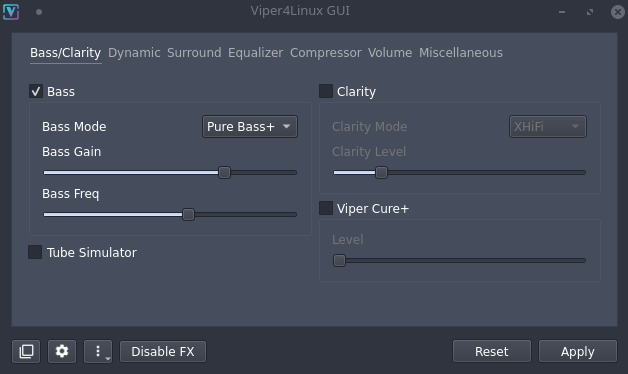
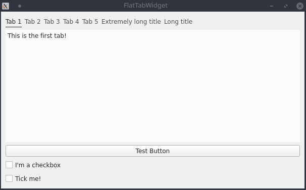
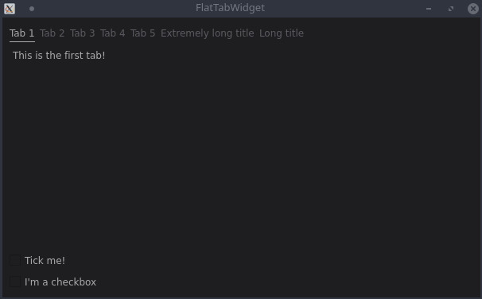

# FlatTabWidget

Animated minimalist tab widget written from scratch for Qt

[Jump to Screenshots section](#screenshots)

## Usage

#### Include it in your project

Copy the `FlatTabWidget` subdirectory from this repository into your project folder and add this to your qmake project file:

```cmake
include(FlatTabWidget/FlatTabWidget.pri)
```

### Use it in your code

```c++
#include <flattabwidget.h>
#include <QApplication>
int main(int argc, char *argv[])
{
    QApplication a(argc, argv);
    FlatTabWidget w;
    w.addPage("Page 1",new QWidget());
    w.addPage("Page 2",new QWidget());
    w.addPage("Page 3",new QWidget());
    w.show();
    return a.exec();
}
```

### Use it in the designer

To use it in the designer, you'll need to setup up a promoted widget. Refer to the [Qt docs](https://doc.qt.io/qt-5/designer-using-custom-widgets.html#promoting-widgets) for further information. Enter these parameters in the input fields of the 'Promoted Widgets' dialog:

| Base class name | Promoted class name | Header file       |
| --------------- | ------------------- | ----------------- |
| `QWidget`       | `FlatTabWidget`     | `flattabwidget.h` |

## Documentation

### Basic

#### Add tab

```c++
void addPage(QString title, QWidget *page = nullptr, int index = -1);
```
Adds a new page. By default, the page will be appended to the end of the page list unless  `index` is set and greater or equal than 0. Parameter `page` is a reference to the widget which will be associated with the new tab.

__Note:__ If you're using a custom tab content widget and FlatTabWidget is in detached mode, you can set that parameter to `nullptr`.

#### Remove tab

```c++
void removePage(int index);
```

Remove tab by index.

#### Get/set current tab

```c++
void setCurrentTab(int index);
int getCurrentTab();
```

Get or set the current shown tab.

#### Redraw widget

```c++
void redrawTabBar();
void repaintDivider();
```

Redraw tab-bar/divider widget. Useful if a new palette has not been applied correctly.

#### Get item/id by tab title

```c++
int getId(QString title) const;
FlatTabItem getItem(QString title) const;
```

Get index or tab-item by title

**Note:** `FlatTabItem` contains a reference to the animated label and the underlying widget provided by the user.

#### Get item by index

```c++
FlatTabItem getItem(int index) const;
```

Get tab-item by index

#### Redraw widget

```c++
void redrawTabBar();
void repaintDivider();
```

Redraw tab-bar/divider widget. Useful if a new palette has not been applied correctly.

#### Redraw widget

```c++
bool getAnimatePageChange() const;
void setAnimatePageChange(bool value);
```

Enable/disable fade animation when switching to another page

### Advanced

#### Set/get custom page container (QStackedWidget)

```c++
QStackedWidget* getCustomStackWidget();
void setCustomStackWidget(QStackedWidget* value);
```

Set a custom/external `QStackedWidget` to be used as a page container. The pages of the `QStackedWidget` will be fully managed by `FlatTabWidget` (add/remove pages and update the currently visible sub-widget) unless detached mode is enabled. In order to unset your custom container call the setter function like this:

```c++
setCustomStackWidget(nullptr);
```

#### Set/get detached mode (for custom containers)

```c++
bool getDetachCustomStackedWidget() const;
void setDetachCustomStackedWidget(bool value);
```

Set/get detachment state of the custom page container. This mode only takes effect when a custom `QStackedWidget` is used.
If this is set to `true`, the tab widget will no longer add/remove pages to/from the stacked widget. It will only update the current page index. This is useful if you want to handle pages manually or if you want to use your own `QStackedWidget` with static pages directly in the designer.


### Signals

```c++
void tabClicked(int index);
```

Signal is sent when the user clicks on one of the tab buttons. `index` describes the current index.

```c++
void scrolledUp();
```

Signal is sent when the user scrolls on the tab-bar up

```c++
void scrolledDown();
```

Signal is sent when the user scrolls on the tab-bar down

## Screenshots

FlatTabWidget in action:



Bundled sample project:



Bundled sample project (dark):



____

Check my other Qt widgets/add-ons out: <https://timschneeberger.me/qt>

